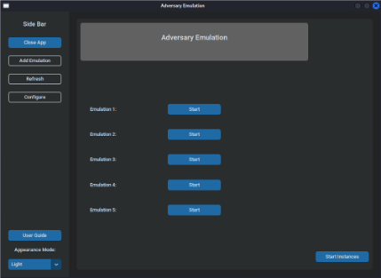
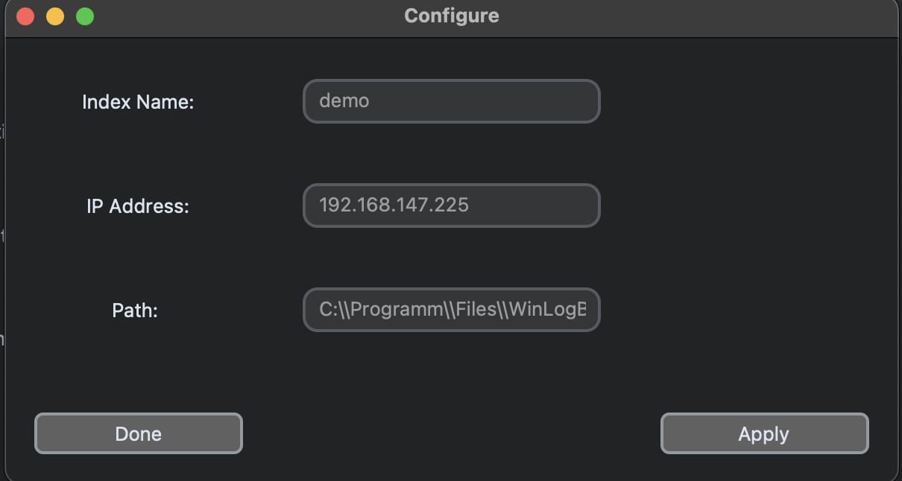
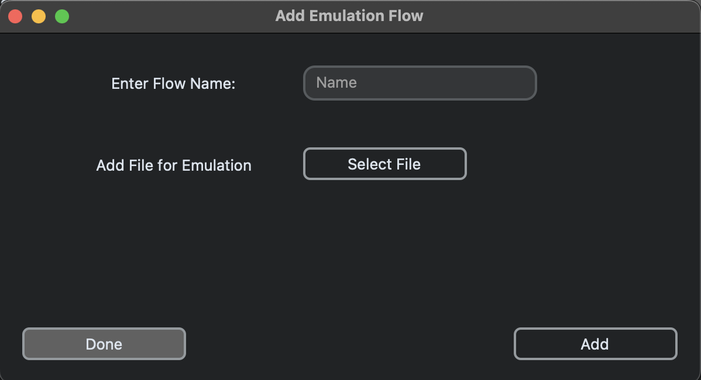

# UserGuide

## Table of Contents
1. [Introduction](#1-introduction)
2. [About this Guide](#2-about-this-guide)
3. [Installation](#3-installation)

   3.1 [System Requirements](#31-system-requirements)

   3.2 [Installation Instructions](#32-installation-instructions)

4. [Starting the application](#4-starting-the-application)

5. [Start Instances](#5-start-instances)

6. [Configure](#6-configure)

7. [Generate yml file](#7-generate-yml-file)

8. [Add Emulation Flow](#8-add-emulation-flow)

9. [Start Emulation](#9-start-emulation)

10. [Others](#10-others)

## 1. Introduction

This application seeks to help in managing and streamlining adversary emulation. 

## 2. About this Guide

This guide gives you an overview of features in this application, and how you can get started with the installation and running it.

## 3. Installation

### 3.1 System Requirements

This application requires Python 3.10 or later to work. You can either install the latest version of python on your system directly or install it in a virtual environment.

Operating System: Linux or MacOS

### 3.2 Installation Instructions

1. Install tkinter using the command below.

    `sudo apt install python3-tk -y`

2. Install the rest of the depenencies using the requirements.txt file using the command below.

    `pip install -r requirements.txt`

## 4. Starting the application

Once the dependencies are installed, run the `run.sh` file to start the application.

1. Give permission to run the file using this command 

    `chmod +x run.sh`

2. Give permission to run a script required by the app.

    `chmod +x /app/start_instances.sh` or
    `chmod +x {path}/app/start_instances.sh`

3. Run the following command on terminal

    `./run.sh` or `{path}/run.sh`

If it runs successfully, you should see this application.

## 5. Start instances

The `Start Instances` button on the bottom right hand corner would start the instances of virtual machines in the KVM. 

You can edit the `start_instances.sh` in the `app` folder to edit the username and ip address to the server you are using.

You can also add or edit the code after ssh to the domain and snapshots you want to use in the following format.

`virsh snapshot-revert --domain {domain_name} --snapshotname "snapshot_name}"`

`virsh reboot --domain {domain_name}`

This is an example of how it can be done.
`virsh snapshot-revert --domain win10-clone --snapshotname "demo"`

`virsh reboot --domain win10-clone`

## 6. Configure

Click the `configure` button on the left. The following popup would appear

You can set the Index Name for the Elastic Search's index, IP address for the Elastic Search's IP address and path where you want to save the generated WinLogBeat yml file on your local machine before transfering the file over to the machines you want to log.

## 7. Generate yml file

Once you are done with the configuration, click the `Generate` button on the bottom right hand side of the application to generate the winlogbeat yml file, which should be saved in the path you have specified. Transfer the yml file to the target machines before starting simulation.

When the winlogbeat yml file is generated, the Elastic Search Index would be "winlogbeat-" followed by index name specified in the configuration, followed by datetime where the yml file is generated (e.g. `winlogbeat-demo202210191016`, winlogbeat-{name}{year}{month}{day}{hour}{minute}).

## 8. Add Emulation Flow

To include a new emulation flow/ automation script, click on the `Add Emulation` button on the left of the application. A popup for you to add emulation flow would appear as shown below.

Enter the emulation flow name consisting of only alphanumeric characters. Select the script to include by clicking on the `Select File` button. Click `Add button` when you have entered the name and selected the file. Click `Done` when you are done.

Once you return to the main application window, click `Refresh` on the left of the application for the newly added emulation flows to appear.

## 9. Start Emulation

Start emulation by clicking the `Start` button next to the emulation flow name. Ensure that your script starts the winlogbeat service before the actual simulation, and stops it after that. You should be able to see logs being piped to Elastic Search after starting the simulation.

This application supports different simulations running at the same time, so you can start multiple adversary emulations as desired.

For your reference, the `demo` emulation flow runs the `example.py` script.

## 10. Others

1. Light, Dark and System Default

You can switch between Light, Dark and System Default mode by clicking the button on the button left of the application.

2. Link to UserGuide

If you need help with using the application, you can click the `userguide` button on the bottom left of the application, above the switch mode button.